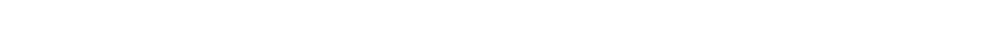

::: lang-toggle
<button class="lang-toggle-btn active" data-lang="en">

English

</button>

<button class="lang-toggle-btn" data-lang="fr">Français</button>
:::

::::::: lang-en
:::::: lang-en
## Research Interests

\[Add a brief introduction to your research interests here\]

## Current Projects

### Project 1: \[Project Title\]

::: project-container
{.project-image}

\[Add project description here. Explain the objectives, methods, collaborators, and significance of the research.\]

**Collaborators:** \[Names and institutions\]

**Funding:** \[Funding sources if applicable\]
:::

------------------------------------------------------------------------

### Project 2: \[Project Title\]

::: project-container
{.project-image}

\[Add project description here. Explain the objectives, methods, collaborators, and significance of the research.\]

**Collaborators:** \[Names and institutions\]

**Funding:** \[Funding sources if applicable\]
:::

------------------------------------------------------------------------

### Project 3: \[Project Title\]

::: project-container
{.project-image}

\[Add project description here. Explain the objectives, methods, collaborators, and significance of the research.\]

**Collaborators:** \[Names and institutions\]

**Funding:** \[Funding sources if applicable\]
:::

## Publications

See my full publication list on the [Publications page](publications.html).
::::::
:::::::

:::::: lang-fr
## Intérêts de recherche {.lang-fr}

\[Ajoutez une brève introduction à vos intérêts de recherche ici\]

## Projets en cours {.lang-fr}

### Projet 1:  {.lang-fr}

::: project-container
{.project-image}

\[Ajoutez la description du projet ici. Expliquez les objectifs, méthodes, collaborateurs et l'importance de la recherche.\]

**Collaborateurs:** \[Noms et institutions\]

**Financement:** \[Sources de financement si applicable\]
:::

------------------------------------------------------------------------

### Projet 2: \[Titre du projet\] {.lang-fr}

::: project-container
{.project-image}

\[Ajoutez la description du projet ici. Expliquez les objectifs, méthodes, collaborateurs et l'importance de la recherche.\]

**Collaborateurs:** \[Noms et institutions\]

**Financement:** \[Sources de financement si applicable\]
:::

------------------------------------------------------------------------

### Projet 3: \[Titre du projet\] {.lang-fr}

::: project-container
{.project-image}

\[Ajoutez la description du projet ici. Expliquez les objectifs, méthodes, collaborateurs et l'importance de la recherche.\]

**Collaborateurs:** \[Noms et institutions\]

**Financement:** \[Sources de financement si applicable\]
:::

## Publications {.lang-fr}

Consultez ma liste complète de publications sur la [page Publications](publications.html).
::::::

```{=html}
<script>
// Language toggle functionality
document.addEventListener('DOMContentLoaded', function() {
  let currentLang = localStorage.getItem('language') || 'en';
  setLanguage(currentLang);
  
  document.querySelectorAll('.lang-toggle-btn').forEach(btn => {
    btn.addEventListener('click', function() {
      const lang = this.dataset.lang;
      setLanguage(lang);
      localStorage.setItem('language', lang);
    });
  });
});

function setLanguage(lang) {
  // Hide all language content
  document.querySelectorAll('.lang-en, .lang-fr').forEach(el => {
    el.style.display = 'none';
  });
  
  // Show selected language content
  document.querySelectorAll('.lang-' + lang).forEach(el => {
    el.style.display = 'block';
  });
  
  // Update active button state
  document.querySelectorAll('.lang-toggle-btn').forEach(btn => {
    btn.classList.remove('active');
    if (btn.dataset.lang === lang) {
      btn.classList.add('active');
    }
  });
  
  // Update TOC if present
  setTimeout(() => filterTOC(lang), 100);
  setTimeout(() => filterTOC(lang), 500);
  setTimeout(() => filterTOC(lang), 1000);
}

function filterTOC(lang) {
  const tocItems = document.querySelectorAll('#TOC li');
  
  tocItems.forEach(li => {
    const link = li.querySelector('a');
    if (!link) return;
    
    const href = link.getAttribute('href') || '';
    const text = link.textContent.toLowerCase();
    
    const frenchSections = ['intérêts-de-recherche', 'projets-en-cours', 'publications'];
    const englishSections = ['research-interests', 'current-projects', 'publications'];
    
    const isFrench = frenchSections.some(section => href.includes(section));
    const isEnglish = englishSections.some(section => href.includes(section));
    
    if (lang === 'en' && isFrench) {
      li.style.display = 'none';
    } else if (lang === 'fr' && isEnglish) {
      li.style.display = 'none';
    } else {
      li.style.display = '';
    }
  });
}
</script>
```